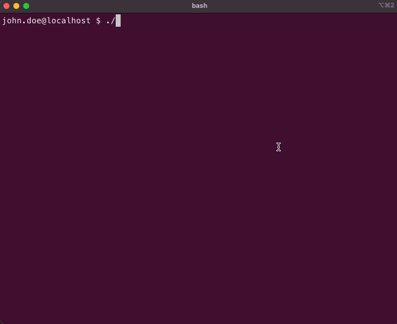

```
███╗   ██╗██╗   ██╗██████╗ ███████╗███████╗    ██╗   ██╗ ██╗
████╗  ██║██║   ██║██╔══██╗██╔════╝██╔════╝    ██║   ██║███║
██╔██╗ ██║██║   ██║██████╔╝███████╗█████╗      ██║   ██║╚██║
██║╚██╗██║██║   ██║██╔══██╗╚════██║██╔══╝      ╚██╗ ██╔╝ ██║
██║ ╚████║╚██████╔╝██║  ██║███████║███████╗     ╚████╔╝  ██║
╚═╝  ╚═══╝ ╚═════╝ ╚═╝  ╚═╝╚══════╝╚══════╝      ╚═══╝   ╚═╝
```

[](https://github.com/Danie1/atyourservice/actions/workflows/python-tests.yml)

- - -

`nurse.py` is a command-line tool to retrieve diagnostic information from user's environments with their consent.

Its simplicity (1 file, compatible with all Python versions, zero non-builtin dependencies) allows even non-technical users to interact with it.

It provides an interface for:

* Execution of shell commands and storage of their output
* Asking of questions, including followup questions, to refine the diagnosis
* Fetching of files and directories
* Reading a `checklist.json` configuration file that defines the implementation of above interfaces

All the data captured by `nurse.py` is archived and zipped, ready to be transferred and later analyzed.

By default `nurse.py` will look for `checklist.json` in the directory it is called from. The `checklist.json` defines the steps implementing the interface `nurse.py` provides.

For security, we always advise to validate the integrity of the `checklist.json` by using the `-hash` flag with the corresponding SHA256 you may have received with it.

Using Nurse, the interactive session will look like so:


## Download

```
curl -sSL https://raw.githubusercontent.com/cyberark/atyourservice/main/nurse/nurse.py > nurse.py
```

## Compatability

* Supports both Python 2.7 and Python3.x

## Usage

Run ```python nurse.py``` in the directory it was previously downloaded to.

Answer all questions defined in the `checklist.json` to complete the diagnosis.

For additional options, run `python nurse.py -h`:

```
usage: nurse.py [-h] [-p PATH] [-hash HASH] [-s] [-v] [-d] [--extra-info]

Nurse utility: Information capturing tool using the corresponding configurable instructions located in a 'checklist.json' file.

optional arguments:
  -h, --help            show this help message and exit
  -p PATH               path to the checklist.json configuration file
  -hash HASH, --hash HASH
                        verify with a corresponding sha256 hash of the checklist.json for security
  -s, --silent          use the pre-configured default answers from the checklist.json as the user's answers
  -v, --verbose         print logs and additional information for troubleshooting the Nurse utility
  -d, --dry-run         run Nurse without saving any of the output
  --extra-info          prints additional information on questions, files and commands
```

## Example

Given a `checklist.json` with the following json-formatted content:

```
{
    "version": "2022-02-22",
    "configuration": {
        "directory": "<$HOME>",
        "prefix": "Diagnosis_",
        "defaults": {
            "priority": 100
        },
        "begin_message": "If you need assistance, you may schedule a call to perform this step together with a representative.",
        "end_message": "Thank you for your cooperation. Please upload the archive to your case."
    },
    "questions": [
        {
            "question": "Are you a premium member? [y/N]:",
            "description": "Premium members receive additional support from our representatives",
            "answer": {
                "user": "",
                "default": "N"
            },
            "followup": [
                {
                    "condition": "Y",
                    "question": "Did you open an issue on our premium support platform? [Y/n]:",
                    "answer": {
                        "user": "",
                        "default": "Y"
                    },
                    "silent": false,
                    "followup": []
                }
            ]
        },
        {
            "question": "What is your registered username?:",
            "description": "We need this information to link this issue to your account",
            "silent": false,
            "answer": {
                "user": "",
                "default": ""
            },
            "followup": []
        }
    ],
    "files": [
        {
            "question": "Allow us to fetch your operating system information?[Y/n]:",
            "description": "We need this information to understand how you are running our software",
            "answer": {
                "user": "",
                "default": "Y",
                "condition": "Y"
            },
            "paths": [
                {
                    "src": "/etc/redhat-release",
                    "description": "This path on RedHat based distributions contains the OS information"
                },
                {
                    "src": "/etc/os-release",
                    "description": "This path on Linux distributions contains the OS information"
                }
            ]
        }
    ],
    "commands": [
        {
            "question": "Allow us to save the path nurse.py is running from?[Y/n]:",
            "answer": {
                "user": "",
                "default": "Y",
                "condition": "Y"
            },
            "paths": [
                {
                    "command": "pwd",
                    "description": "This command returns in a file the path nurse.py is located when executed",
                    "output_path": "path/created/in/archive/pwd_output.txt"
                },
                {
                    "command": "pwd",
                    "description": "This command returns inline the path nurse.py is located when executed"
                }
            ]
        }
    ]
}
```

## Writing a Checklist.json

The checklist.json should consist of all the instructions required to capture the information.

It is divided into 4 top sections:

1. `"version"` \- a date value in the international standard date notation \(YYYY\-MM\-DD\) that describes when this checklist\.json has been last modified
2. `"configuration"` \- a section that specifies general configuration
3. `"questions"` \- specifies questions\, including follow\-up questions to ask the user
4. `"files"` \- specifies files and directories to include in the final \.zip archive
5. `"commands"` \- specifies commands to execute\, and to include their output in the final \.zip archive

*For reference: "questions", "files" and "commands" will also be referred to as "actions" in this documentation.*

**Take into consideration:**

* All `"user"` answers of "yes" and "no", including partial such as "ye" will be automatically converted to "Y" and "N". This conversion is performed regardless of case-sensitivity. When planning the `"condition"` field in actions, use "Y" or "N" for a "Yes" or "No" answers.

### "version"

This field specifies that the date the corresponding checklist.json has been last modified was on the 22nd of February, 2022.

**Example:**
`"version": "2022-02-22"`

### "configuration"

* `"directory"` \- specifies the directory path to write the final \.zip archive
* `"prefix"` \- specifies the prefix to use when creating the \.zip archive\. Recommended: Use the product's or issue's abbreviation for filing and sorting
* `"defaults"` \- specifies the supported defaults you can configure\, such as the `priority`
    * `"priority"` \- specify the default priority that should be used in case an action does not specify one in advance\. The priority is used to sort the order of execution for the actions\. The final order may include a mixed order of actions from the various types\. The smaller the number\, the higher the priority \(i\.e\. a priority 100 action is executed before priority 300 actions\)
* `"begin_message"` \- specifies a customized message to display to the user when Nurse starts
* `"end_message"` \- specifies a customized message to display to the user when Nurse finishes

**Example:**

```
"configuration": {
        "directory": "/home/john.doe",
        "prefix": "ProcessCrash_",
        "defaults": {
            "priority": 100
        },
        "begin_message": "If you need assistance, you may schedule a call to perform this step together with a representative.",
        "end_message": "Thank you for your cooperation. Please upload the archive to your case."
    }
```

### "questions"

* `"question"` \- specify in free\-text which information you need from the user
* `"description"` \- includes additional information for the user\, so they are able to improve their answer to the question\. This will only be displayed upon the `"--extra-info"` flag.
* `"priority"` **(Optional)** \- in case this field exists\, it will specify the priority of this action\, which will override the default specified in the configuration section\.
* `"answer"` -
    * `"user"` \- this is a slot for the user's response\. It should be left empty in case you wish to receive an answer interactively\.
    * `"default"` \- specifies the default answer to suggest the user\. Additionally\, in case of using the `"--silent"` flag, this will be taken as the user's answer if it hasn't been pre-filled in the user field.
* `"followup"` \- specifies a list of questions to be asked\, in case the parent question's `"user"` field value matches the `"condition"` field of any of the questions specified here
* `"condition"` **(Only for follow-up questions)** \- a value which will be compared to the parent question's `"user"` field. In case of a match, the questions will be asked.

**Example:**

```
"questions": [
        {
            "question": "This can be a Yes/No question, when answering Yes or Y you will see the follow-up question. Would you like to see it? [Y/n]:",
            "description": "This is additonal information that can be entered, that when using the --extra-info flag the user will see.",
            "priority": 200,
            "answer": {
                "user": "",
                "default": "Y"
            },
            "followup": [
                {
                    "condition": "Y",
                    "question": "Are you aware that if you had entered No, this question would not appear?  [Y/n]:",
                    "description": "This is true thanks to the `condition` field above. The question is entirely free-text.",
                    "answer": {
                        "user": "",
                        "default": "Y"
                    },
                    "followup": []
                }
            ]
        },
        {
            "question": "Did you know you can include multiple questions, one after another?:",
            "description": "These questions do not relate to one another, and can also be displayed in a different order thanks to the `priority` field below",
            "priority": 100,
            "answer": {
                "user": "",
                "default": "I didnt know that!"
            },
            "followup": []
        }
    ]
```

##### Follow-up Questions

These questions allow nesting questions to be asked following a specific answer from the user.

An example of such a question would be: "Is it raining outside?"
In case it isn't raining, you won't need to ask the user "Did you bring a rain-coat?".

Make sure the `"condition"` field matches the desired parent-question `"user"` response 1:1.

### "files"

* `"question"` \- specify in free\-text which information you need from the user
* `"description"` \- includes additional information for the user\, so they are able to improve their answer to the question\. This will only be displayed upon the "\-\-extra\-info" flag\.
* `"priority"` **(Optional)** \- in case this field exists\, it will specify the priority of this action\, which will override the default specified in the configuration section\.
* `"answer"`
    * `"user"` \- this is a slot for the user's response\. It should be left empty in case you wish to receive an answer interactively\.
    * `"default"` \- specifies the default answer to suggest the user\. Additionally\, in case of using the "\-\-silent" flag\, this will be taken as the user's answer if it hasn't been pre\-filled in the user field\.
    * `"condition"` \- in case the "user" field matches this field\, the patch will be retrieved and included in the final \.zip archive
* `"paths"` \- specifies a list of paths\, in the following structure\, to include in the final \.zip archive:
    * `"src"` \- specifies the path which could be either a file or directory
    * `"description"` - includes additional information for the user, so they are able to improve their answer to the question. This will only be displayed upon the "--extra-info" flag.
    * `"until"` **(Optional)** \- when this field exists\, it will specify the timeframe in which files will be present\. Example: if specified "20 days ago"\, all files from 20 days ago until today will be included in the final \.zip archive\. The format is: "\<Integer\> \<Unit\> ago"\. Units include "milliseconds"\, "microseconds"\, "seconds"\, "minutes"\, "hours"\, "days"\, "months" and "years"\.

**Example:**

```
"files": [
        {
            "question": "Allow us to fetch your operating system information?[Y/n]:",
            "description": "We need this information to understand how you are running our software",
            "answer": {
                "user": "",
                "default": "Y",
                "condition": "Y"
            },
            "paths": [
                {
                    "src": "/etc/redhat-release",
                    "description": "This path on RedHat based distributions contains the OS information",
                },
                {
                    "src": "/etc/os-release",
                    "description": "This path on Linux distributions contains the OS information",
                }
            ]
        },
        {
            "question": "Allow us to fetch all files from the current directory?[Y/n]:",
            "description": "We need this information to understand whether the right files coexist with nurse.py",
            "answer": {
                "user": "",
                "default": "Y",
                "condition": "Y"
            },
            "paths": [
                {
                    "src": "./",
                    "description": "This is the current path nurse.py is running from",
                    "until": "1 hour ago"
                }
            ]
        }
    ]
```

### "commands"

* `"question"` \- specify in free\-text which information you need from the user
* `"description"` \- includes additional information for the user\, so they are able to improve their answer to the question\. This will only be displayed upon the "\-\-extra\-info" flag\.
* `"priority"` **(Optional)** \- in case this field exists\, it will specify the priority of this action\, which will override the default specified in the configuration section\.
* `"answer"`
    * `"user"` \- this is a slot for the user's response\. It should be left empty in case you wish to receive an answer interactively\.
    * `"default"` \- specifies the default answer to suggest the user\. Additionally\, in case of using the "\-\-silent" flag\, this will be taken as the user's answer if it hasn't been pre\-filled in the user field\.
    * `"condition"` \- in case the "user" field matches this field\, the command will be executed
* `"paths"` \- specifies a list of commands\, in the following structure\, to include in the final \.zip archive\, within the `checklist_response.json`:
    * `"command"` \- specifies the command to execute
    * `"description"` - includes additional information for the user, so they are able to improve their answer to the question. This will only be displayed upon the "--extra-info" flag.
    * "output\_path"

**Example:**

```
"commands": [
        {
            "question": "Allow us to save the path nurse.py is running from?[Y/n]:",
            "answer": {
                "user": "",
                "default": "Y",
                "condition": "Y"
            },
            "paths": [
                {
                    "command": "pwd",
                    "description": "This command returns the path nurse.py is located when executed",
                }
            ]
        }
    ]
```

### Additional Functionality

###### Environment Variables

When writing questions, or within the configuration section, you may specify environment variables to be used.

This can be performed by writing the environment variable name with the prefix `<$` and a `>` suffix.

**Example 1:** The HOME environment variable contains the home-path on most Linux distributions. By specifying `<$HOME>` within the "directory" configuration, you can use it to write the final .zip archive there.

**Example 2:** Use the USER environment variable to print the local user's name within a question by specificying `<$USER>` in a "question" field.

*Tip: You can use the command `env` on Linux/MacOS to view which environment variables exist.*

*Note: Advanced users can leverage this functionality to insert additional information within environment variables, to be used in the Nurse execution.*

## Contributing

For more info on contributing, please see [CONTRIBUTING.md](CONTRIBUTING.md).

## License

Copyright (c) 2022 CyberArk Software Ltd. All rights reserved.

The atyourservice project is available under the [Apache 2.0 License](../LICENSE.md).

This set of utilities is provided to the community for facilitating troubleshooting issues. It is not officially supported by CyberArk.